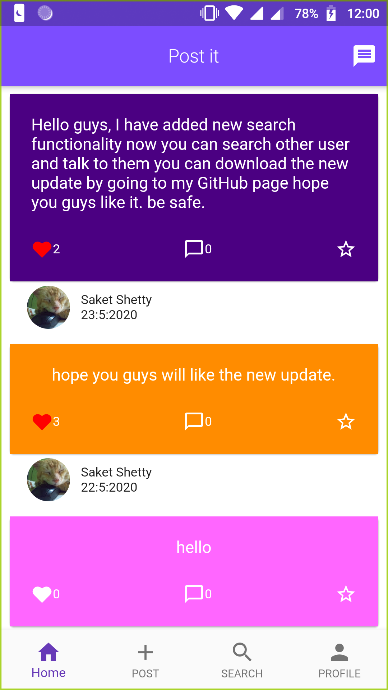
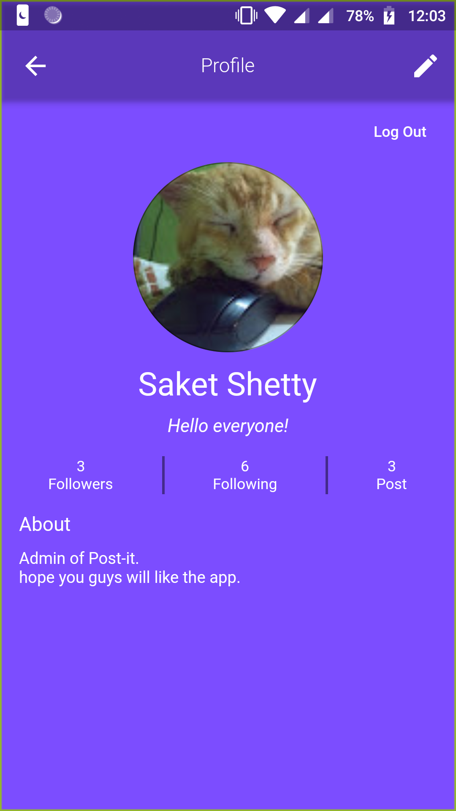
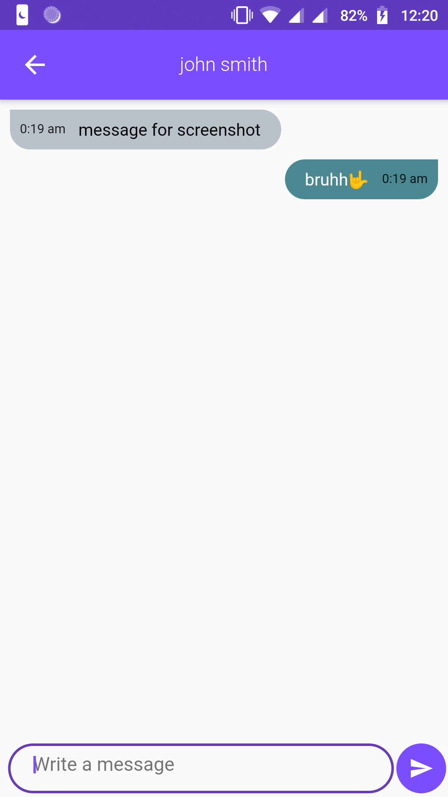
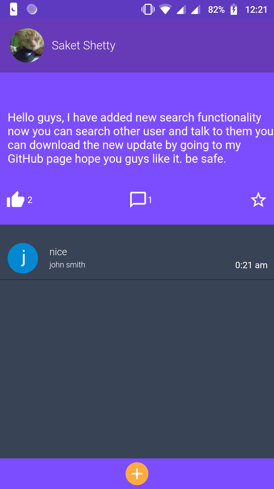
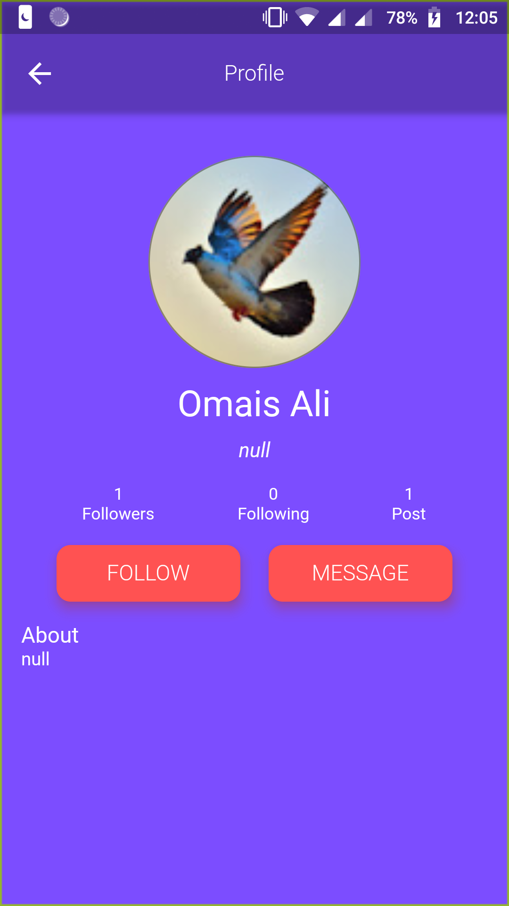
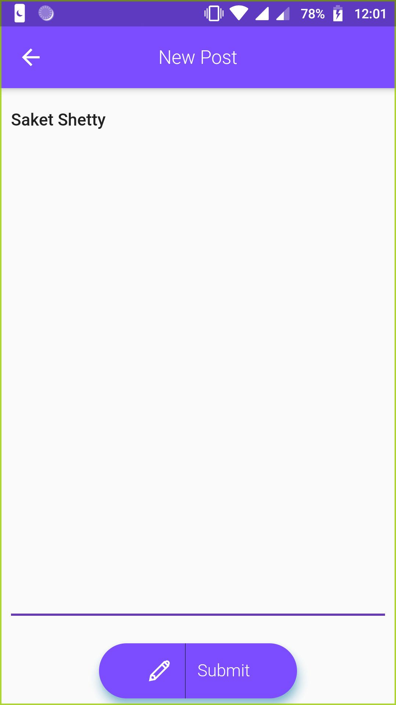
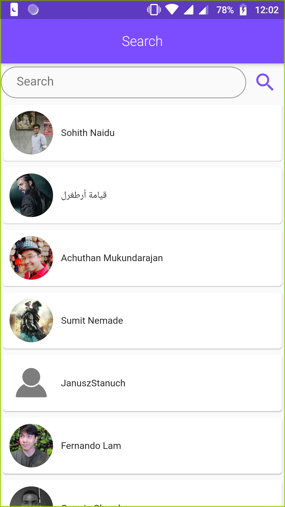
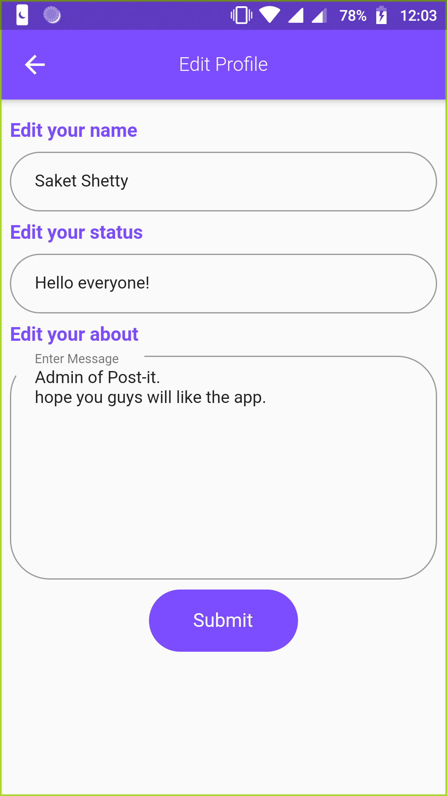

<h3>Post It</h3>

- [Android](https://github.com/saket-shetty/Post-it/raw/master/build/app/outputs/apk/release/app-release.apk)

<table>
  <tr>
    <td></td>
     <td></td>
     <td></td>
  </tr>
    <tr>
     <td></td>
     <td></td>
     <td></td>
   </tr>
  <tr>
     <td></td>
     <td></td>
     <td></td>
   </tr>

</table>

Please replace my googleservice.json with yours.

Post it is a social media app which is made entirely with flutter and firebase.
The user can login with both Google and Facebook. 

The user will get the notification if his/her post gets comments or someone else post a new post or anyone will send personal message to them.  

Search functionality is added, now user can search other user and can follow and message them.  

It uses UTC(Universal Time Co-ordinate) to store and sort the data and the time cannot be manipulate or change by user.
The app is made with MediaQuery so it can be run in any device without any UI issue. 

The user can see the amout of like and comment a post got in the main page. 

User can see the post history of other user. 

The user can follow other users. 

If user logs in successfully a session is been created. 

Now in this new update the user can also report other user if they misbehave and that user will not be able to post unless admin allows them and user will only see the 10 recently added posts and not every data of database as previous. 

Any Query contact: shettysaket05@gmail.com
