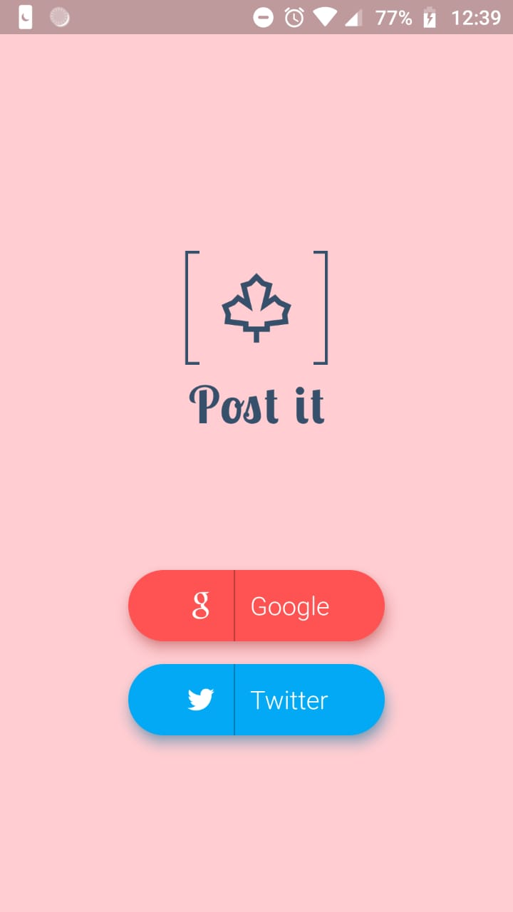
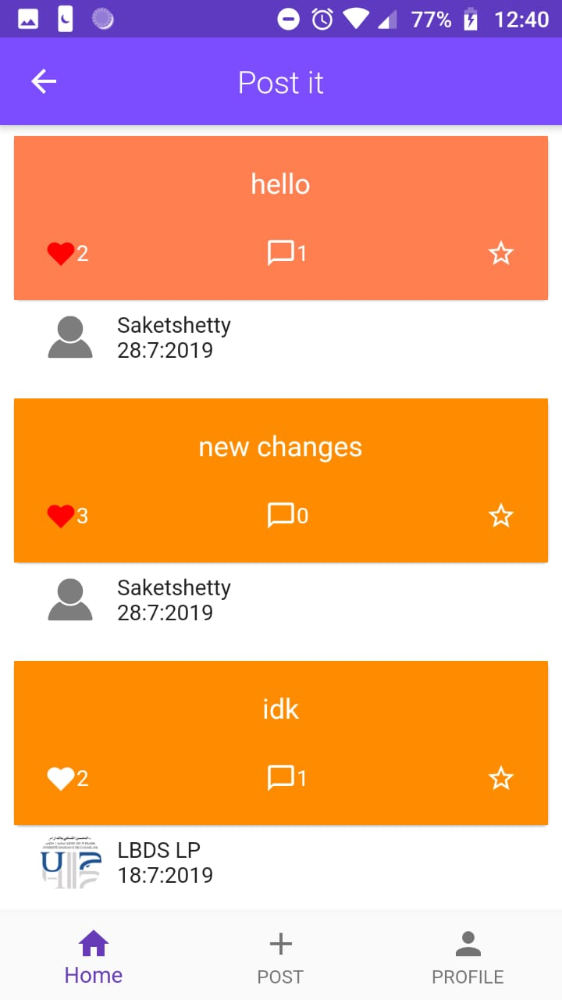
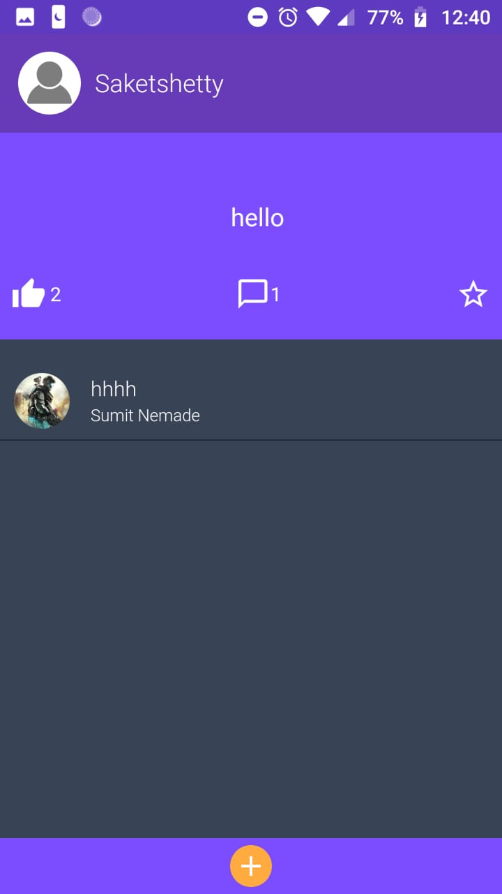
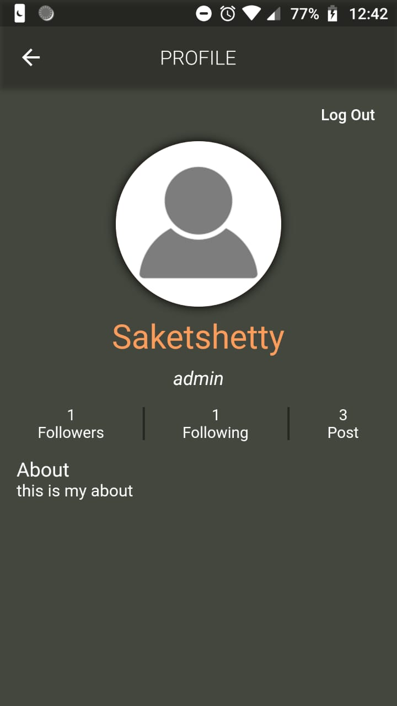
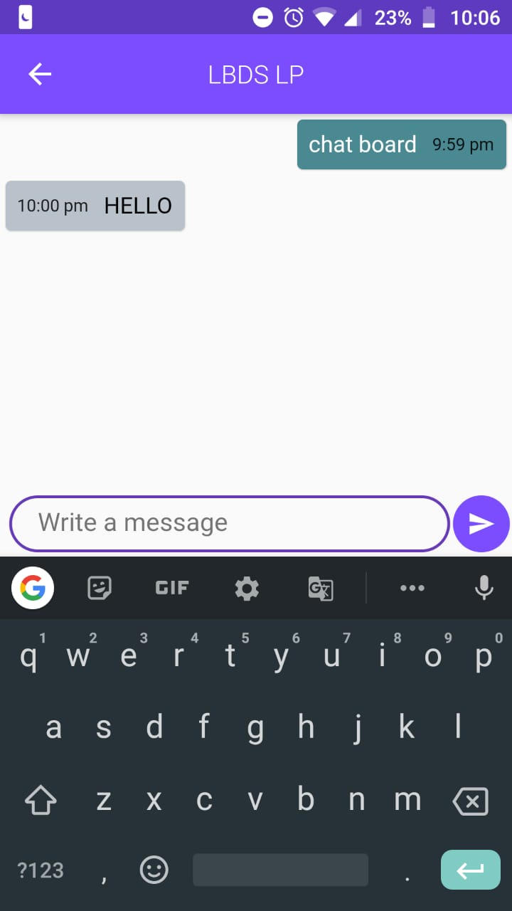

<h3>Post It</h3>

App link: https://drive.google.com/open?id=1cOBkuDWbt3fOvkcgi930rCXG2PDcYWne 

Post it is a social media app which is made entirely with flutter and firebase.
The user can login with both Google and Twitter. 

It uses UTC(Universal Time Co-ordinate) to store and sort the data and the time cannot be manipulate or change by user.
The app is made with MediaQuery so it can be run in any device without any UI issue. 

The user can now see the amout of like and comment a post got in the main page. 

User can now see the post of other user. 

The user can now follow other user and can unfollow the on their own will and the user profile image will be stored in canche so no need of download image again and again. 

Session is been created so that user does not have to login again and again. 

Now in this new update the user can also report other user if they misbehave and that user will not be able to post unless admin allows them and user will only see the 10 recently added posts and not every data of database as previous 

In this new update instead of default icon and splash created a new icon and splash screen for the app which will run for the set time 

Any Query contact: shettysaket05@gmail.com

<table>
  <tr>
     
     
     
  </tr>

</table>

# firebaseapp

A new Flutter application.

## Getting Started

For help getting started with Flutter, view our online
[documentation](https://flutter.io/).
